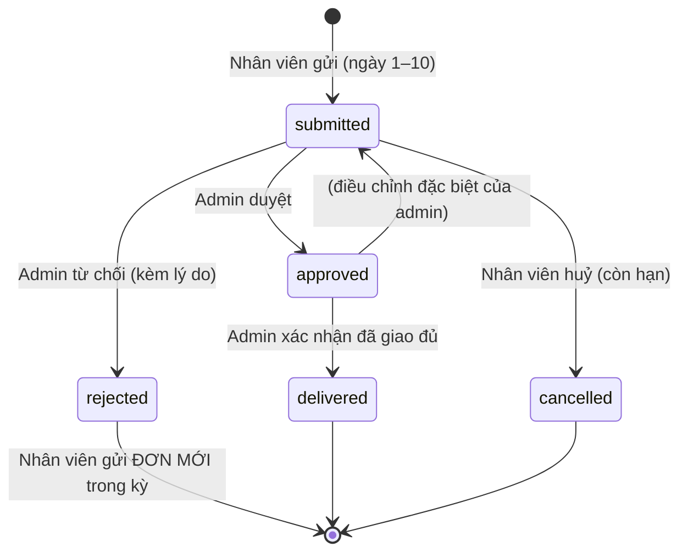
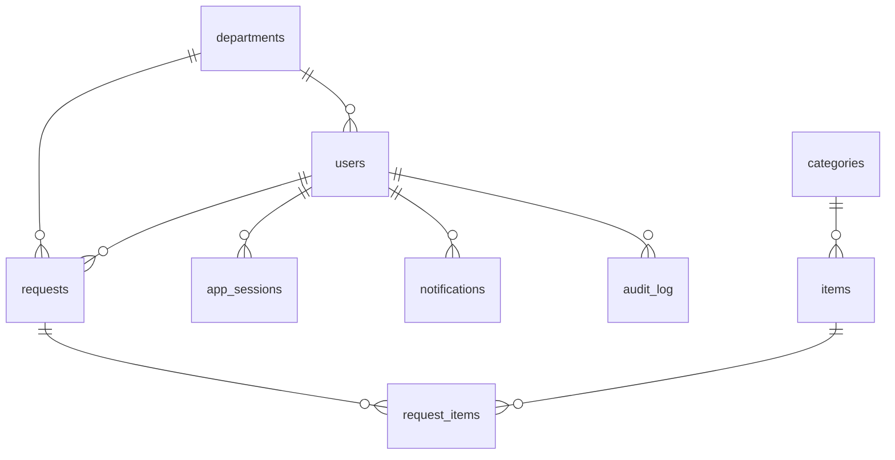

# SDD — Software Design Document — Website Đăng ký Văn phòng phẩm (DE-VPP)

> Phiên bản **v4 — khớp PRD v1.2 (PMH ID SSO)** · Quy mô: **Vừa (≤ 500 người dùng)** · Ngày: 2026-08-06
> Trạng thái: **ĐÃ DUYỆT — đang thi công**. Xong **M0**, **M1**
> (CSDL + SSO), **M2** (nghiệp vụ backend), **M3** (giao diện nhân viên) và **M4**
> (giao diện quản trị).
> Đang tới **M5** (đóng gói demo Docker đầy đủ + chạy thử).
> Tài liệu này là **thiết kế kỹ thuật (SDD)**, đồng bộ với `docs/product/PRD.md` v1.2.
>
> **⚠️ Xác thực = PMH ID SSO.** Toàn bộ phần **danh tính/đăng nhập** (OIDC + Directory + Webhook + BCL, BFF, bảng `users`/`app_sessions`, map group→vai trò/phòng ban, mock IdP demo) nằm ở **`docs/architecture/SSO-INTEGRATION.md`** — tài liệu đó **ưu tiên** khi có khác biệt. Dưới đây chỉ tóm tắt phần liên quan.

---

## 0. Kết quả phỏng vấn (các quyết định đã chốt)

| #   | Chủ đề                 | Quyết định                                                                                                                                                          |
| --- | ---------------------- | ------------------------------------------------------------------------------------------------------------------------------------------------------------------- |
| 1   | **Vai trò**            | Chỉ **Nhân viên (member)** + **Admin**. Không có trưởng phòng, không có bộ phận kho.                                                                                |
| 2   | **Xác thực**           | **PMH ID SSO (OIDC)** — không tự quản mật khẩu. Tích hợp **đầy đủ** (OIDC + Directory + Webhook + BCL). Xem `SSO-INTEGRATION.md`.                                   |
| 3   | **Danh tính**          | User đến từ PMH ID (khoá `sub`); danh bạ qua **Directory API**. Vai trò admin = group `VPP-Admin`; phòng ban từ `groups`. **Không** tạo/import tài khoản trong app. |
| 4   | **Tích hợp ngoài**     | **Không** (khép kín).                                                                                                                                               |
| 5   | **Hạ tầng**            | Chưa chốt → **demo Docker trước**, kiến trúc để mở cho on-prem/cloud/VPS.                                                                                           |
| 6   | **Quy trình**          | **Có duyệt**: `Đã gửi → Đã duyệt → Đã giao`, hoặc `Bị từ chối`.                                                                                                     |
| 7   | **Từ chối**            | Admin **từ chối kèm lý do** → nhân viên **được gửi lại** trong kỳ.                                                                                                  |
| 8   | **Giá tiền**           | **Không** dùng đơn giá/thành tiền. Báo cáo chỉ loại VPP + số lượng.                                                                                                 |
| 9   | **Kỳ đăng ký**         | **1 đơn hiệu lực / người / tháng**, gửi 1 lần **không tự sửa** (admin điều chỉnh đặc biệt).                                                                         |
| 10  | **Định mức**           | Chỉ **mỗi món ≤ 20**. Không định mức phòng ban/ngân sách.                                                                                                           |
| 11  | **Thông báo**          | **Trong app (chuông)** — báo duyệt/từ chối/đã giao; báo admin có đơn mới. Không email.                                                                              |
| 12  | **Nhật ký & thống kê** | Có **lịch sử theo kỳ** + **audit chi tiết** + **thống kê nhiều kỳ (biểu đồ)**.                                                                                      |
| 13  | **Hiệu năng**          | Thiết kế **dư tải** (index, phân trang, pool) — vẫn 1 API + 1 DB.                                                                                                   |
| 14  | **Bảo mật**            | Xác thực **PMH ID SSO (OIDC + PKCE)**; **không lưu mật khẩu**; phiên (BFF) có hạn 7 ngày. _(MFA/khoá do PMH ID quản.)_                                              |
| 15  | **Phạm vi demo**       | **Làm đầy đủ tất cả** tính năng đã chốt rồi mới demo.                                                                                                               |
| 16  | **Danh mục VPP**       | Dùng **danh mục mẫu (~25 món)** cho demo.                                                                                                                           |

---

## 1. Mục tiêu

Website nội bộ để **nhân viên đăng ký VPP hằng tháng**; **admin duyệt → tổng hợp → xác nhận đã giao → xuất báo cáo trình ký**. Thay thế quy trình Google Form + Sheet.

---

## 2. Vai trò & phân quyền

| Chức năng                       | Member | Admin |
| ------------------------------- | :----: | :---: |
| Đăng ký VPP cho bản thân        |   ✅   |  ✅   |
| Đăng ký giấy A4                 |   ❌   |  ✅   |
| Xem đơn của mình                |   ✅   |  ✅   |
| Xem tất cả đơn / lọc            |   ❌   |  ✅   |
| **Duyệt / Từ chối** đơn         |   ❌   |  ✅   |
| **Xác nhận đã giao**            |   ❌   |  ✅   |
| Điều chỉnh đơn (đặc biệt)       |   ❌   |  ✅   |
| Quản lý danh mục VPP            |   ❌   |  ✅   |
| Xem danh bạ (đồng bộ Directory) |   ❌   |  ✅   |
| Xuất báo cáo Excel              |   ❌   |  ✅   |
| Xem thống kê / audit            |   ❌   |  ✅   |
| Nhận thông báo (chuông)         |   ✅   |  ✅   |

Phân quyền enforce ở **backend** (Guard theo vai trò), không tin giao diện.

---

## 3. Vòng đời đơn đăng ký (state machine)



- **Ràng buộc:** mỗi người chỉ có **1 đơn "đang hiệu lực"** (`submitted`/`approved`/`delivered`) cho một kỳ. Đơn `rejected`/`cancelled` được giữ làm lịch sử và cho phép tạo đơn mới.
- **Xác nhận giao** làm theo **từng dòng** hoặc **toàn bộ**; khi mọi dòng `delivered` → đơn `delivered`.

---

## 4. Kiến trúc

> **✅ Đã chốt: Phương án A — Modular Monolith gọn** (xem `ARCHITECTURE-OPTIONS.md`). Một backend NestJS (API + BFF + webhook/BCL + jobs in-process) · 1 PostgreSQL · SPA sau nginx · ảnh **đĩa cục bộ** · **không** Redis/object-storage/worker riêng. Jobs bằng `@nestjs/schedule` (+ Postgres `SKIP LOCKED` khi cần). Giữ **module hoá + API stateless** (phiên ở DB) để nâng lên Phương án B khi có tín hiệu tải thật.

| Lớp             | Công nghệ                                                                                                                                                                       |
| --------------- | ------------------------------------------------------------------------------------------------------------------------------------------------------------------------------- |
| Frontend        | React 19 + Vite + **Ant Design** + TanStack Query + React Router 7 + **ECharts** (biểu đồ) + i18next (VI) + Be Vietnam Pro                                                      |
| Backend         | **NestJS 11** + **Drizzle ORM** + **PostgreSQL 16**                                                                                                                             |
| Auth            | **PMH ID SSO (OIDC + PKCE)** theo mẫu **BFF** — api là confidential client (`openid-client` + `jose`), giữ token ở server, cấp cookie phiên `httpOnly`. **Không lưu mật khẩu.** |
| Danh bạ/sự kiện | **Directory API** (M2M) + **Webhook** (HMAC) + **Back-Channel Logout**                                                                                                          |
| Excel / Upload  | **ExcelJS** / **multer**                                                                                                                                                        |
| Đóng gói        | **pnpm monorepo** (`apps/api`, `apps/web`, `packages/shared`) + **Docker Compose** (demo thêm service **`mock-idp`** thay PMH ID)                                               |

```
Trình duyệt ─(8080)─▶ web (nginx, React build) ─/api▶ api (NestJS :3000) ─▶ postgres :5432
                                                          │  └─ volume: uploads (ảnh mục "Khác")
                                                          └─ OIDC ─▶ PMH ID  (prod)
                                                                     mock-idp (demo, trong Docker)
                                          IdP ─POST webhook/BCL─▶ api  (/api/webhooks, /api/auth/backchannel-logout)
```

- 1 API + 1 Postgres đủ cho ≤500; nginx proxy `/api` (cookie same-origin).
- API **không giữ mật khẩu**; phiên (BFF) lưu token OIDC ở DB → sẵn sàng scale ngang.
- **Demo:** `mock-idp` (OIDC giả) đứng thay PMH ID; đổi sang PMH ID thật chỉ bằng cấu hình (issuer/client). **Prod sau EDGE:** theo **LUẬT VÀNG mạng edge** — chỉ `vpp-web` lên mạng `edge`, `api` gọi IdP qua `host-gateway` (xem `SSO-INTEGRATION.md` §10).

---

## 5. Mô hình dữ liệu (PostgreSQL)



| Bảng              | Cột chính                                                                                                                                                                                                                                                 |
| ----------------- | --------------------------------------------------------------------------------------------------------------------------------------------------------------------------------------------------------------------------------------------------------- |
| **departments**   | id, name (unique), created_at — _cache tên phòng ban suy ra từ `groups` PMH ID_                                                                                                                                                                           |
| **users**         | id (uuid), **pmh_sub** (unique), email, name, employee_code, **groups** (text[]), **department**, role (`admin`\|`member`), disabled, source (`login`\|`directory`), last_login_at, created_at, updated_at — _KHÔNG có password (xem SSO-INTEGRATION §4)_ |
| **app_sessions**  | id (uuid = cookie), user_id, **id_token**, **access_token**, **refresh_token**, access_expires_at, session_expires_at, created_at — _BFF giữ token OIDC; không mật khẩu_                                                                                  |
| **categories**    | id, name, is_other, sort_order                                                                                                                                                                                                                            |
| **items**         | id, category_id, name, unit, **admin_only** (A4), **max_qty**=20, active, sort_order                                                                                                                                                                      |
| **requests**      | id, code (unique), user_id, department_id, **period** (YYYY-MM), **status** (submitted/approved/rejected/delivered/cancelled), note, **reject_reason**, approved_by, approved_at, delivered_at, reviewed_by, created_at, updated_at                       |
| **request_items** | id, request_id (cascade), item_id (nullable=Khác), name, unit, quantity, **delivered**, delivered_qty, **attachment_path**, note                                                                                                                          |
| **notifications** | id, user_id, type, title, body, request_id, read_at, created_at                                                                                                                                                                                           |
| **audit_log**     | id, actor_id, actor_name, action, object_type, object_id, detail (jsonb), created_at                                                                                                                                                                      |

**Ràng buộc & Index**

- Đơn hiệu lực duy nhất: **partial unique** `(user_id, period) WHERE status IN ('submitted','approved','delivered')`.
- Index: `users(pmh_sub)` unique, `requests(period)`, `requests(department_id)`, `requests(status)`, `request_items(request_id)`, `items(category_id, active)`, `notifications(user_id, read_at)`, `audit_log(created_at)`, `app_sessions(user_id)`, `app_sessions(session_expires_at)`.

---

## 6. Quy tắc nghiệp vụ (gom trong `packages/shared`)

| Quy tắc                        | Cài đặt                                                                                           |
| ------------------------------ | ------------------------------------------------------------------------------------------------- |
| Cửa sổ đăng ký **1–10**        | `isRegistrationOpen(now)`; member gửi ngoài cửa sổ → `REGISTRATION_CLOSED`. Admin bỏ qua.         |
| Kỳ theo tháng                  | `periodForDate(now)`: ≤10 → tháng này; ≥11 → tháng sau.                                           |
| Cấm **A4** với member          | Item `admin_only=true` → member chọn bị chặn (`ITEM_ADMIN_ONLY`).                                 |
| Mỗi món **≤ 20**               | `quantity` ∈ [1, max_qty].                                                                        |
| Mục **"Khác" + ảnh**           | Dòng `item_id=null`, `name` tự nhập, `attachment_path`.                                           |
| **1 đơn hiệu lực/kỳ**          | Partial unique index; từ chối/huỷ mới được gửi lại.                                               |
| **Không sửa sau khi gửi**      | Member không sửa đơn `submitted`/`approved`; chỉ **huỷ** hoặc admin điều chỉnh.                   |
| **Điều kiện huỷ** (FR-23)      | Member chỉ huỷ khi đơn `status='submitted'` **và** còn trong cửa sổ 1–10.                         |
| **Chỉ giao sau duyệt** (BR-09) | Các API "giao" chỉ chấp nhận đơn `status='approved'` (hoặc đang giao dở); đơn chưa duyệt → chặn.  |
| **Danh tính qua SSO**          | App không quản mật khẩu; đăng nhập qua PMH ID, upsert user theo `sub` (xem `SSO-INTEGRATION.md`). |

_Giờ:_ container đặt `TZ=Asia/Ho_Chi_Minh`.

---

## 7. API (REST, tiền tố `/api`)

**Auth / hồ sơ (OIDC — chi tiết ở SSO-INTEGRATION §6):** `GET /auth/login` (→ IdP), `GET /auth/callback`, `POST /auth/logout` (local), `GET /auth/logout-global` (end_session), `POST /auth/backchannel-logout` (IdP→app), `GET /me`, `GET /registration/status`
**Danh bạ/sự kiện:** `POST /webhooks/pmh-id` (HMAC), Directory sync job (M2M). _(Bỏ `/auth/login {email,password}` và `/me/change-password`.)_

**Danh mục:** `GET /catalog` · admin: `POST/PATCH/DELETE /admin/categories`, `/admin/items`

**Đơn:** `POST /requests`, `GET /requests/mine`, `GET /requests/:id`, `DELETE /requests/:id` (huỷ — chỉ khi `submitted` & còn ngày 1–10)
· admin: `GET /requests?period=&departmentId=&status=&page=&pageSize=` (phân trang), `GET /requests/summary?period=`, `PATCH /requests/:id`
· **duyệt:** `POST /requests/:id/approve`, `POST /requests/:id/reject {reason}`
· **giao** (chỉ đơn đã duyệt — BR-09): `POST /requests/:id/items/:lineId/deliver`, `POST /requests/:id/deliver-all`, `POST /requests/:id/undeliver-all`

**Thông báo:** `GET /notifications`, `POST /notifications/:id/read`, `POST /notifications/read-all`

**Thống kê / Audit (admin):** `GET /admin/stats?from=&to=`, `GET /admin/audit` (phân trang)

**Danh bạ / phòng ban (admin):** `GET /admin/users` (đọc từ bảng users, đã đồng bộ Directory), `POST /admin/directory-sync` (đồng bộ ngay), `GET /departments` (suy ra từ `groups`). _(Không tạo/sửa/import tài khoản — danh tính do PMH ID quản.)_

**Upload / Export:** `POST /uploads`, `GET /uploads/:file` · `GET /export/requests.xlsx?period=&departmentId=` (admin)

> **Mẫu Excel (FR-41):** 2 sheet _(Tổng hợp theo món + Chi tiết theo người)_ **+ khối tiêu đề** (tên đơn vị, "Kỳ tháng M/YYYY", ngày lập) **+ logo công ty** _(chờ cung cấp)_ **+ khối ô chữ ký** cuối bảng (Người lập / Trưởng bộ phận / Ban giám đốc).

---

## 8. Danh sách màn hình

> **Responsive (NFR-04):** mọi màn hình dùng tốt trên **máy tính và điện thoại** (Antd responsive: menu thu gọn, bảng cuộn ngang, form 1 cột trên mobile). Giao diện dùng **theme trung tính đặt chỗ**; áp **tên + logo + màu** khi bạn cung cấp.

**Chung:** **Đăng nhập qua PMH ID** (không có form mật khẩu riêng — bấm "Đăng nhập" → chuyển sang PMH ID; trang "chưa được cấp quyền" khi `access_denied`) · Khung app (menu theo vai trò, **chuông thông báo**, đăng xuất **local/toàn hệ**, banner "đang mở/đã đóng đăng ký").

**Nhân viên:**

1. Trang chủ (kỳ hiện tại, trạng thái đăng ký, tóm tắt đơn, nút Đăng ký).
2. **Đăng ký VPP** (danh mục theo nhóm, nhập SL ≤20, A4 khoá với member, mục "Khác" + upload ảnh, giỏ, gửi). Ngoài cửa sổ → khoá form.
3. **Đơn của tôi** (lịch sử theo kỳ, chi tiết + trạng thái duyệt/giao; xem lý do từ chối & gửi lại; **huỷ khi đơn `submitted` & còn ngày 1–10**).

**Admin (thêm):** 4. **Bảng điều khiển** + **biểu đồ thống kê nhiều kỳ** (số đơn, số món theo tháng/phòng ban, tỉ lệ đã giao). 5. **Danh sách đăng ký** (lọc kỳ/phòng ban/trạng thái, phân trang). 6. **Duyệt đơn** (duyệt/từ chối kèm lý do). 7. **Tổng hợp theo món** + **Xuất Excel**. 8. **Xác nhận giao** (từng dòng / toàn bộ) + **điều chỉnh đặc biệt** (thêm A4). 9. **Quản lý danh mục VPP** (nhóm & món: admin_only, max_qty, active). 10. **Danh bạ nhân viên** (đọc từ PMH ID qua Directory: tên, phòng ban, vai trò theo group; nút "Đồng bộ ngay"). _(Không tạo/sửa/import — danh tính do PMH ID quản.)_ 11. **Nhật ký audit**. 12. Admin cũng dùng màn **Đăng ký VPP**.

---

## 9. Phi chức năng

- **Bảo mật:** **PMH ID SSO (OIDC + PKCE S256)**; **không lưu mật khẩu**; verify JWT offline (JWKS cache ≤10'); tham chiếu user bằng `sub`; BFF giữ token ở server; cookie phiên `httpOnly`/`sameSite=lax` (prod `secure`), **7 ngày**; refresh-fail ⇒ đăng xuất; webhook HMAC v2 + BCL; validate Zod; chặn path traversal ảnh; ảnh ≤5MB, chỉ `image/*`. _(Chi tiết: SSO-INTEGRATION §11.)_
- **Responsive:** dùng tốt trên máy tính & điện thoại (không app native).
- **Hiệu năng (dư tải):** index như mục 5; phân trang danh sách admin; connection pool Postgres; ảnh phục vụ qua stream. Không cache/queue (chưa cần).
- **Lưu trữ:** đơn & nhật ký giữ **vô thời hạn**.
- **Vận hành:** container hoá; log JSON; sao lưu Postgres định kỳ (tài liệu prod ở M6).
- **i18n / Thương hiệu:** giao diện tiếng Việt (khung i18next); theme **trung tính đặt chỗ**, áp **tên + logo + màu** khi bạn cung cấp.

---

## 10. Kế hoạch triển khai (mỗi mốc DỪNG xin duyệt; chỉ chạy demo khi bạn đồng ý)

| Mốc | Nội dung |
| --- | -------- |

> Tiến độ: **M0 ✅**, **M1 ✅**, **M2 ✅**, **M3 ✅**, **M4 ✅** — đang tới **M5**.

| **M0** | Khung monorepo + `packages/shared` + skeleton Docker |
| **M1** | Backend lõi: DB (schema/migrate/seed), **SSO OIDC (BFF: login/callback/logout, verify JWT, map group→vai trò/phòng ban)** + **mock-idp**, catalog |
| **M2** | Backend nghiệp vụ: requests (đăng ký/kỳ/validate), duyệt/từ chối, giao, điều chỉnh, upload, export, thông báo, audit, stats + **Directory sync, Webhook, BCL** |
| **M3** | Frontend: đăng nhập (redirect PMH ID) + luồng **nhân viên** (đăng ký, đơn của tôi, chuông) |
| **M4** | Frontend: luồng **admin** (duyệt, giao, danh mục, danh bạ/directory, báo cáo, thống kê, audit) |
| **M5** | Docker Compose demo hoàn chỉnh (gồm `mock-idp`) + dữ liệu mẫu + **CHẠY THỬ** |
| **M6** | (sau khi ổn) Ghép **PMH ID thật** (xin client, chốt host/EDGE, redirect/webhook/BCL URI) + tài liệu vận hành prod |

---

## 11. Dữ liệu mẫu (demo)

- **User & group ở `mock-idp`** (đăng nhập qua mock OIDC — xem SSO-INTEGRATION §9): `admin@pmh.com.vn` (groups `VPP-Admin`,`Hành chính` ⇒ admin); nhân viên `an/binh/chi/dung/em@pmh.com.vn` (group = phòng ban ⇒ member). _(Không có mật khẩu app; mock IdP cho chọn user để demo.)_
- **Phòng ban** (suy ra từ groups): Hành chính, Nhân sự, Kế toán, Kỹ thuật, Kinh doanh.
- **Danh mục:** ~25 món / 5 nhóm (Bút & Viết; Giấy & Sổ [A4 = admin_only]; Mực & Toner; Dụng cụ VP; Khác).
- Vài đơn mẫu kỳ hiện tại ở các trạng thái (đã gửi / đã duyệt / đã giao một phần) để màn admin & thống kê có dữ liệu.

---

## 12. Rủi ro & giả định

- **Giả định:** 1 công ty duy nhất; **danh tính do PMH ID quản**; báo cáo chỉ Excel để in ký tay (không chữ ký số).
- **Rủi ro:** cửa sổ 1–10 khoá cứng → thao tác ngoài ngày 1–10 phải do admin (có quyền bỏ qua). Hôm nay ngày 6 → còn trong cửa sổ.
- **Rủi ro SSO:** demo dùng **mock-idp** (không phải PMH ID thật) → cần kiểm lại khi ghép thật (M6): tên group (`VPP-Admin`, group phòng ban), `allow_all_groups`, route BCL/redirect khớp cách mount `/api`, allowlist IP nếu on-prem.
- **Phụ thuộc [⏳]:** (a) **tên + logo + màu** thương hiệu (M4); (b) **client_id/secret + webhook_secret + host** từ admin PMH ID (M6).

---

_Đồng bộ tài liệu:_ `docs/product/PRD.md` v1.2 (yêu cầu) · **`docs/architecture/SSO-INTEGRATION.md`** (xác thực PMH ID — ưu tiên cho phần danh tính). SDD này phản ánh mọi quyết định đã chốt (SSO, điều kiện huỷ, giao-sau-duyệt, responsive, lưu vô thời hạn, mẫu Excel).
