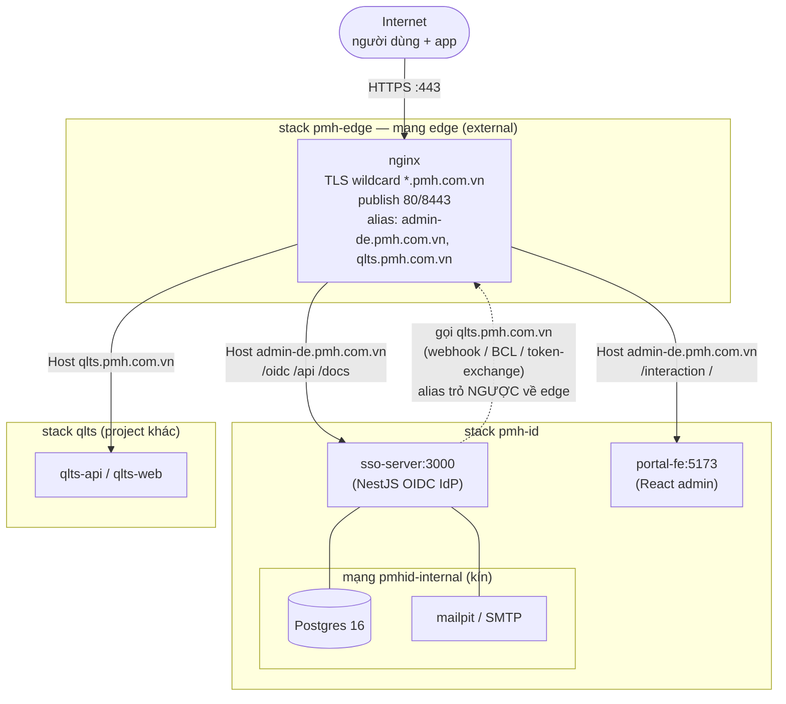
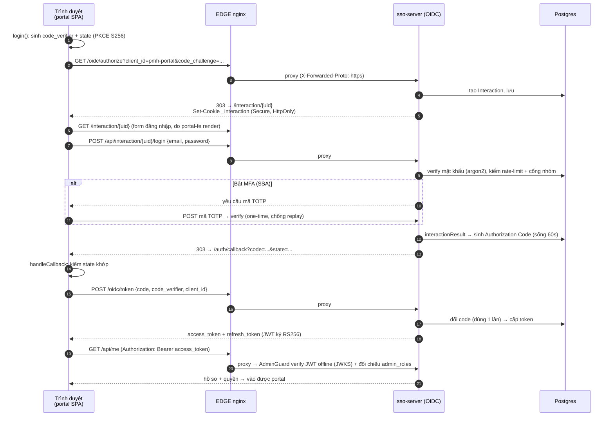
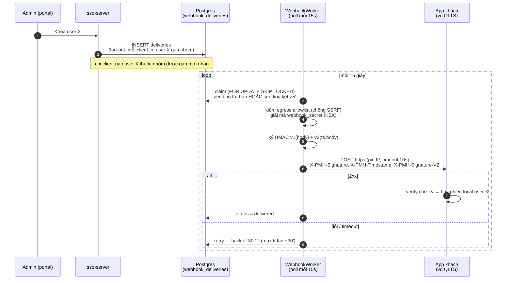
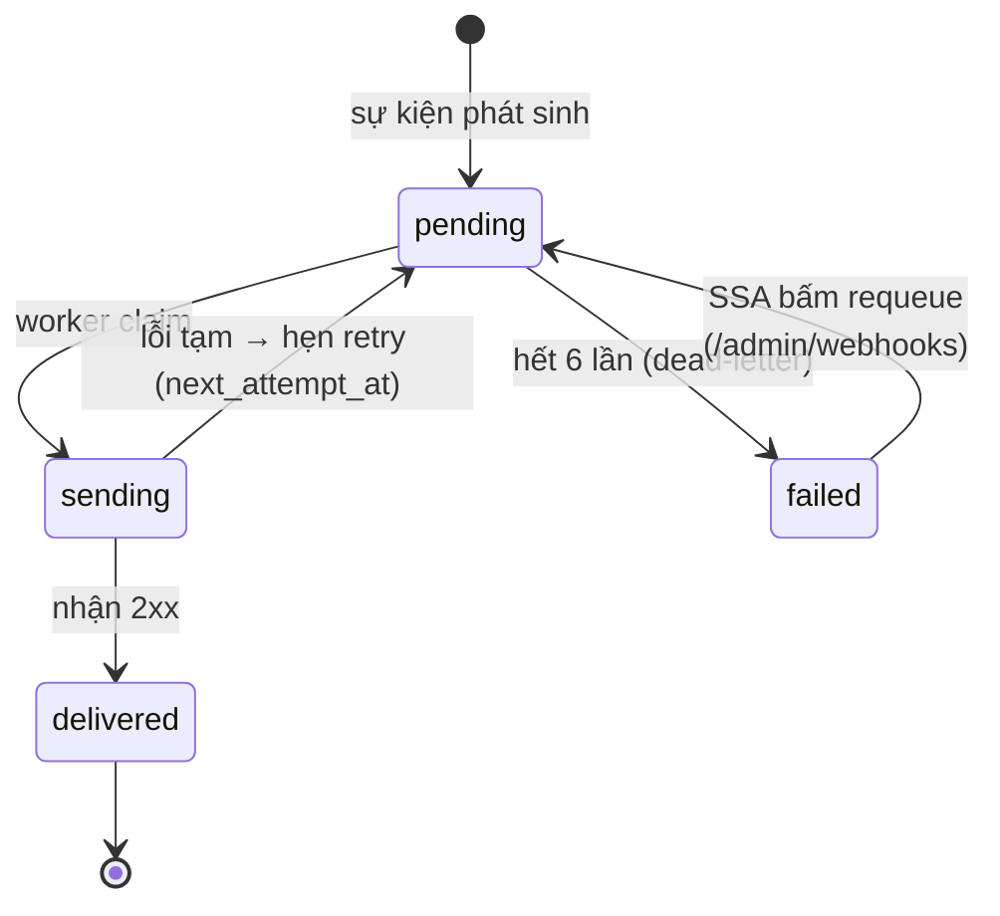
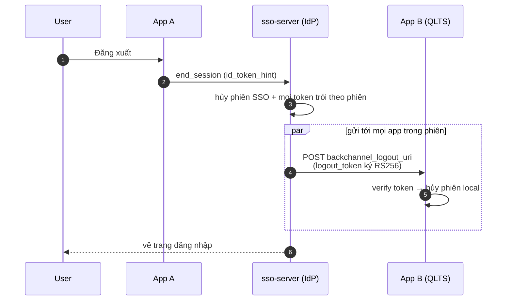
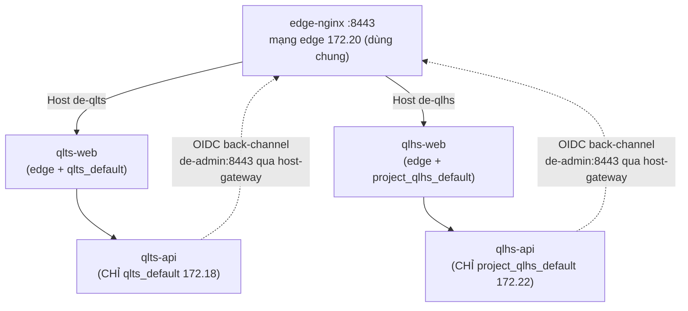

# PMH ID — EDGE & luồng hoạt động

> 📎 **Tài liệu tham khảo nội bộ** (không bắt buộc để tích hợp). Giúp hiểu PMH ID
> vận hành thế nào phía sau; muốn tích hợp thì `README.md` là đủ.

Tài liệu giải thích **pmh-edge** (cổng vào chung) và ba luồng chính: **đăng nhập OIDC**, **webhook**, **đăng xuất toàn hệ (BCL)**.

---

## 1. pmh-edge là gì

`pmh-edge` là **một stack Docker riêng** chỉ chứa **1 nginx** — cổng vào **DUY NHẤT** cho mọi project (PMH ID, QLTS, QLHS…). Nó làm 3 việc:

1. **Chấm dứt TLS (HTTPS)**: giữ cert wildcard `*.pmh.com.vn`, mở cổng `80`/`443` ra internet. Chỉ nó publish 2 cổng này.
2. **Định tuyến theo hostname + path**: cùng cổng 443, nhìn `Host:` và đường dẫn để chuyển sang backend đúng, backend chạy **HTTP thuần** trong mạng nội bộ (không TLS).
3. **Sanitize header**: đặt `X-Forwarded-Proto: https`, `X-Forwarded-For`… để backend biết request đến từ HTTPS qua proxy (AD-4).

**Vì sao tách riêng:** vòng đời độc lập với các project (nâng cert 1 chỗ, không lệch), và nhiều project dùng chung 1 cửa 443 thay vì mỗi project mở 1 cổng.

**Điểm tinh tế — alias mạng:** `sso-server` cần gọi `https://qlts.pmh.com.vn` (gửi webhook, BCL). Trên mạng `edge`, nginx được gán **alias** `qlts.pmh.com.vn` → nên lời gọi này **đi vòng trong máy** tới chính edge (không ra internet), rồi edge route sang qlts. Issuer/URL công khai vẫn giữ nguyên.

**Hai mạng:**

- `edge` (external, dùng chung): edge nginx + sso-server + portal-fe + qlts. Đây là nơi định tuyến.
- `pmhid-internal` (kín): chỉ postgres + mailpit + sso-server. Project khác **không thấy** DB của PMH ID.

**Routing thực tế trong `id.conf`:**

| Đường dẫn (Host = admin-de.pmh.com.vn) | Chuyển tới        |
| -------------------------------------- | ----------------- |
| `/oidc/*` `/api/*` `/docs`             | `sso-server:3000` |
| `/interaction/*` `/` (mọi thứ còn lại) | `portal-fe:5173`  |
| `:80` bất kỳ                           | 301 → HTTPS       |

---

## 2. Luồng đăng nhập OIDC (portal + SSO)

Portal quản trị là **SPA công khai** (không có secret) đăng nhập bằng **PKCE**. Access token nó nhận được chính là "vé" vào API quản trị.

**Ý chính:**

- **PKCE bắt buộc** mọi client (kể cả confidential như QLTS) — chống chặn-cắp mã giữa đường.
- Access token **ngắn** (5 phút), verify **offline** bằng JWKS (không gọi lại IdP mỗi request). Hết hạn thì refresh token xin token mới ngầm — user không bị đá.
- Phiên SSO có **idle 15 phút** (trượt theo hoạt động) và **trần cứng 12 giờ**.

---

## 3. Luồng webhook (đá user tức thì khi bị khóa)

Không có webhook thì user bị khóa vẫn văng — nhưng **chậm ≤5 phút** (chờ token hết hạn). Webhook để đá **tức thì**.

**Vòng đời một delivery:**

**Ý chính:**

- **Fan-out theo nhóm**: chỉ client mà user thuộc nhóm được gán (`client_groups` ⋈ `user_groups`) mới nhận sự kiện của user đó — không lộ chéo tenant.
- **Chống replay (v2)**: chữ ký v2 ký kèm timestamp; receiver kiểm timestamp trong ±5 phút → gói cũ bắt được không phát lại được. (v1 giữ để không gãy khách cũ; khách nên chuyển v2 rồi bỏ v1.)
- **Idempotent**: do có retry, cùng một sự kiện **có thể tới hơn 1 lần** → phía nhận phải xử lý idempotent.
- **Dead-letter**: thất bại hết retry → vào `failed`, **không mất im lặng** — hiện ở `/api/health` (`deadLettered`) và cảnh báo Telegram; SSA gửi lại qua `/admin/webhooks`.

---

## 4. Đăng xuất toàn hệ — Back-Channel Logout (BCL)

Khi kết thúc phiên SSO (một app gọi logout đúng cách), IdP báo **mọi app** để đá user ngay, không chờ token hết hạn.

> Nếu app chỉ xoá session local mà **không** gọi `end_session`, phiên SSO còn sống → user vào lại được ngay. Đó là lỗi tích hợp phía app.

> **⚠️ BCL bắn khi nào — và KHI NÀO KHÔNG (đọc kỹ):** `logout_token` chỉ gửi khi
> phiên SSO kết thúc **CHỦ ĐỘNG**: (a) user bấm **Đăng xuất toàn hệ** (qua
> `end_session`), hoặc (b) admin **Khóa / Hủy phiên / Xóa / Reset mật khẩu** user.
> **KHÔNG** bắn khi phiên **hết idle (15')** hay **token hết hạn thụ động** — lúc đó
> không có sự kiện logout nào để mà bắn.
>
> ⇒ **Mọi app BẮT BUỘC tự xử "refresh thất bại":** refresh token **trói vào phiên**
> (`expiresWithSession`) → phiên chết vì **bất kỳ** lý do gì (idle, logout, bị khóa)
> thì lần refresh kế của app **bị từ chối** (`invalid_grant`). Hãy coi đó là **tín
> hiệu đăng xuất** và xoá phiên local. Đây là cơ chế **luôn đúng cho MỌI trường hợp**
> (kể cả idle — nơi BCL không phủ). **BCL chỉ là lớp đá TỨC THÌ cộng thêm** cho ca
> logout/khoá chủ động, **KHÔNG thay** việc xử lý refresh-fail. Dùng thư viện OIDC
> chuẩn (vd `openid-client`) — nó tự bắt lỗi refresh và gọi hook đăng xuất.

---

## 5. Mô hình mạng Docker — mỗi project một mạng riêng, CHỈ web lên edge

> 🧭 **Đọc mục này TRƯỚC khi đưa project mới vào cụm.** Sai ở đây làm **hỏng cả
> project khác** (đã xảy ra thật — xem "Sự cố alias `api`" bên dưới).

**Mỗi stack docker-compose tự tạo MỘT mạng bridge riêng** (subnet `/16` khác nhau).
Một container **gắn được nhiều mạng cùng lúc**. Bức tranh thực tế:

| Mạng                                       | Subnet              | Ai ở đây                                                                      |
| ------------------------------------------ | ------------------- | ----------------------------------------------------------------------------- |
| `edge` (external, **dùng chung**)          | `172.20.0.0/16`     | edge-nginx + *_các *-web*_ + sso-server + portal-fe. **Nơi định tuyến 8443.** |
| `pmh-id_default` / `pmh-id_pmhid-internal` | `172.19` / `172.23` | PMH ID (sso, portal-fe / postgres, mailpit — DB kín)                          |
| `qlts_default`                             | `172.18`            | QLTS riêng: qlts-api, qlts-web, postgres, redis                               |
| `project_qlhs_default`                     | `172.22`            | QLHS riêng: api, web, postgres                                                |
| `<project>_default`                        | `172.2x`            | Mỗi project mới thêm một dải                                                  |

**Vì sao thấy nhiều subnet (vd 172.18 lẫn 172.20):** `qlts-web` nằm trên **CẢ**
`edge`(172.20) **lẫn** `qlts_default`(172.18); còn `qlts-api` **chỉ** ở `qlts_default`
(172.18). Ẩn dụ: `edge` = **hành lang chung** để nginx :8443 đi vào; mỗi app có
**phòng riêng** (mạng `<project>_default`) để web↔api↔db nói chuyện nội bộ. Đây là
bình thường, **không phải lỗi**.

### ⚠️ LUẬT VÀNG (bắt buộc cho mọi project trên cụm)

1. **CHỈ container `*-web`/frontend lên mạng `edge`**, và phải có **network alias RIÊNG**
   (`qlts-web`, `qlhs-web`, `vpp-web`…). Edge route tới alias riêng này.
2. **Backend `api` KHÔNG BAO GIỜ lên `edge`.** Docker gán alias mặc định = tên service
   (`api`). Nhiều project cùng tên `api` trên `edge` → **đụng tên**.
3. **api gọi PMH ID (`de-admin:8443`, token/jwks/BCL) qua host-gateway**, không cần lên
   edge: thêm `extra_hosts: ["de-admin.pmh.com.vn:host-gateway"]` (host publish edge:8443).
4. **Không hardcode IP** container (IP đổi khi recreate). Nginx phải dùng `resolver
127.0.0.11` + biến (`set $up http://...; proxy_pass $up;`) để re-resolve.

> **🔥 Sự cố alias `api` (đã xảy ra 2026-08-04):** khi cho `qlhs-api` join `edge`, nó
> mang alias `api` trên edge. `qlts-web` (ở cả edge + qlts_default) proxy `/api →
http://api:3000`, resolve `api` ra **NHẦM qlhs-api** (172.20.x) thay vì qlts-api
> (172.18.x) → **mọi /api của QLTS = 404**, QLTS "lỗi đăng nhập". IdP hoàn toàn vô
> can. Chẩn nhanh: `docker exec <project>-web getent hosts api` — ra IP subnet edge
> (172.20.x) là dính. Sửa: gỡ api khỏi edge (Luật 2), gọi de-admin qua host-gateway
> (Luật 3). _(Recreate api có thể làm kẹt kết nối edge↔web → `docker restart <project>-web`.)_

### Đường dẫn BCL/callback tùy quy ước route của app

`backchannel_logout_uri` (và `redirect_uris`) **phải khớp cách app mount route** — hai
app có thể khác nhau mà **cùng đúng**:

| App      | Mount route                                         | Web nginx `/api`                          | URL công khai của BCL                    |
| -------- | --------------------------------------------------- | ----------------------------------------- | ---------------------------------------- |
| **QLTS** | global prefix `/api` (health ở `/api/health`)       | **giữ** path (`$request_uri`)             | `…:8443/api/backchannel-logout`          |
| **QLHS** | mount ở **root** (health `/health`, auth `/auth/*`) | **strip** `/api/` (proxy_pass có dấu `/`) | `…:8443/api/**auth**/backchannel-logout` |

→ Không có "chuẩn" cứng cho path — nó **phản ánh nội bộ từng app**. Khi đăng ký ở PMH
ID, hãy **test thật**: `curl -X POST <uri>` → **404 = sai route**, **400/200 = đúng
route**. Chức năng thì **giống hệt nhau** (nhận `logout_token` → verify → hủy phiên local).

---

## Tóm tắt 1 dòng mỗi khối

| Khối            | Vai trò                                                                                                                                          |
| --------------- | ------------------------------------------------------------------------------------------------------------------------------------------------ |
| **pmh-edge**    | Cổng 443 duy nhất, chấm dứt TLS, route theo Host+path, backend chạy HTTP nội bộ                                                                  |
| **Mạng Docker** | `edge`(172.20) dùng chung — CHỈ web lên, alias riêng; mỗi project một `_default` riêng cho api/db; api gọi IdP qua host-gateway (KHÔNG lên edge) |
| **sso-server**  | IdP OIDC: authorize/token, quản user/nhóm/client, MFA, audit, webhook worker                                                                     |
| **portal-fe**   | SPA quản trị, đăng nhập PKCE, gọi `/api/*` bằng Bearer token                                                                                     |
| **Postgres**    | Nguồn sự thật: user, phiên/token (oidc_payloads), hàng đợi webhook/email, settings                                                               |
| **webhook**     | Báo app khách khi user bị khóa/xóa/đổi nhóm → đá tức thì (thay cho chờ ≤5')                                                                      |
| **BCL**         | Logout/khoá **chủ động** → đá user khỏi MỌI app **tức thì**. Idle/hết-hạn thụ động KHÔNG bắn BCL → app tự xử qua refresh-fail                    |
